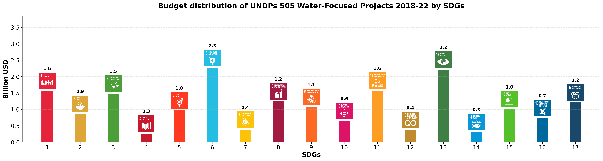

# SDG Budget Visualization

## Overview
This module creates visually appealing bar charts displaying the distribution of UNDP budget allocations across the Sustainable Development Goals (SDGs). The visualization incorporates official SDG icons, proper color coding, and professional styling.

## Features
- Creates high-resolution PNG visualizations
- Incorporates official UN SDG icons
- Uses standardized SDG color scheme
- Exports CSV data alongside visualizations
- Supports multiple time periods (2018-2024, 2018-2022)
- Configurable styling and proportions

## Example Visualization


## Input Data
The module reads processed budget data from:
- CSV files generated by the calculation module
- Optional metadata for context (e.g., project counts)

## Output
The module produces:
1. High-resolution PNG visualizations (saved to `data/plots/`)
2. Optional exported CSV data

## Usage
```bash
# Generate SDG budget visualizations
python script.py

# Generate with custom input file
python script.py --input-file path/to/input.csv

# Generate with custom output directory
python script.py --output-dir path/to/output

# Generate with custom title
python script.py --title "Custom Visualization Title"
```

This will:
1. Process the budget data
2. Generate visualizations with official SDG iconography
3. Save the output to the designated directory

## Technical Details

### SDG Icons
The visualization uses official UN SDG icons located in `assets/sdg_icons/`. Each icon is displayed above its corresponding bar with proper proportional sizing.

### Color Scheme
Each SDG is represented using its official color:

| SDG | Color Code | Description |
|-----|------------|-------------|
| 1   | #E5243B    | No Poverty  |
| 2   | #DDA63A    | Zero Hunger |
| 3   | #4C9F38    | Good Health and Well-being |
| ... | ...        | ... |

### Customization Options
The visualization can be customized by modifying:
- Figure dimensions
- Bar width and spacing
- Icon size and proportions
- Font sizes and styles
- Grid styling and background

## Integration
This module completes the data visualization pipeline, consuming data from the calculation module in `scripts/calculate_budget_by_sdg/` and producing publication-ready visualizations.

## Dependencies
- Python 3.x
- pandas
- matplotlib
- Official SDG icon files (PNG format)
